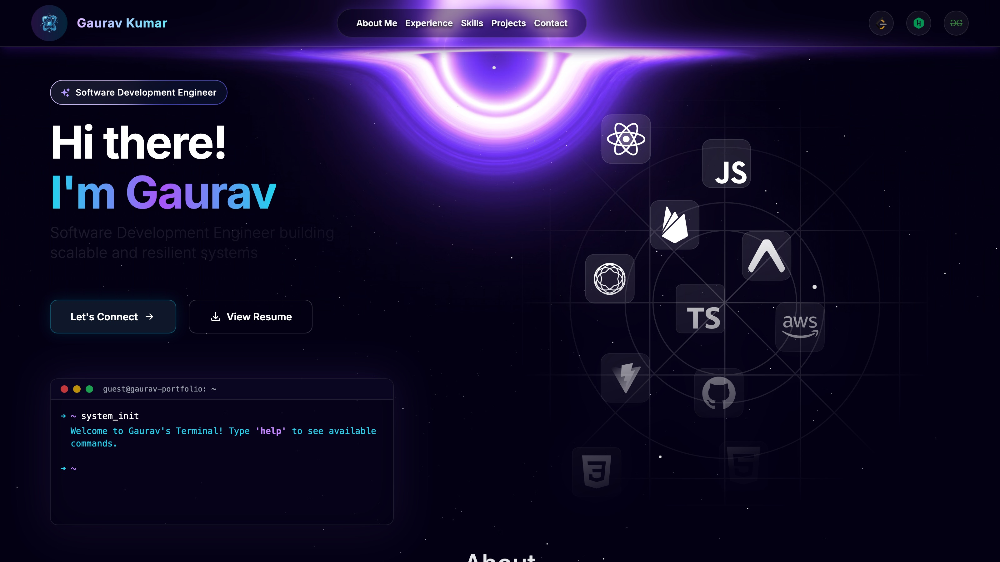
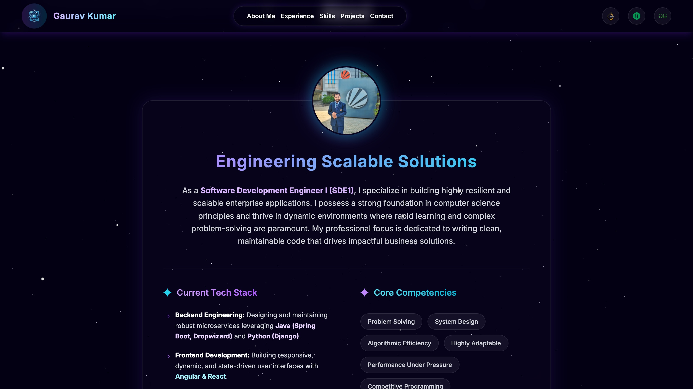
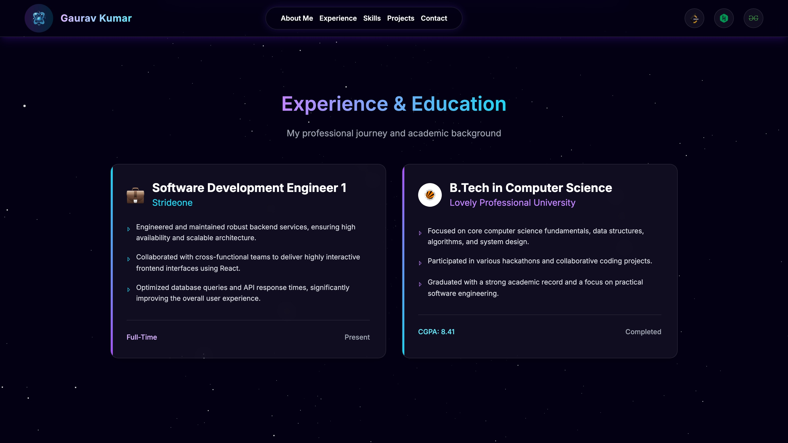
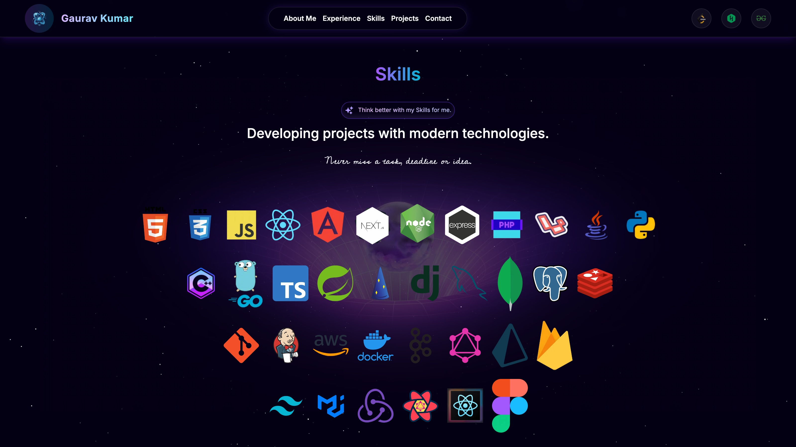
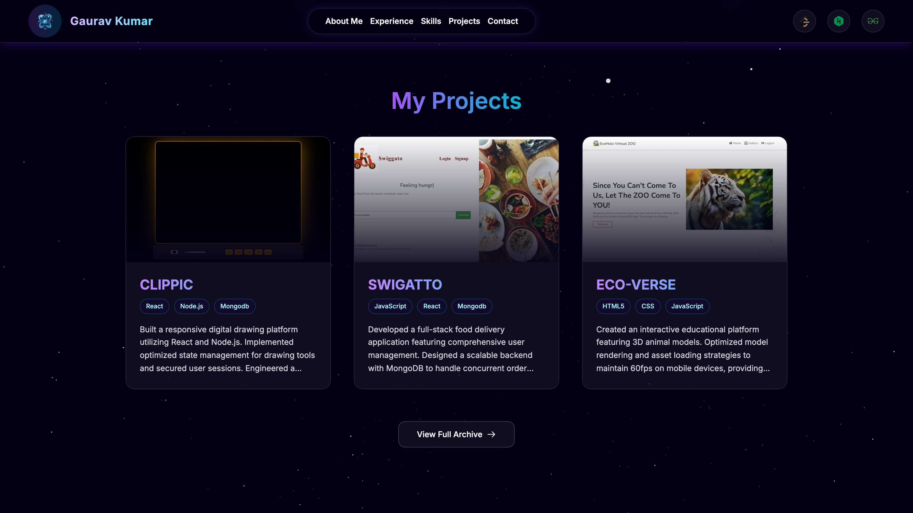
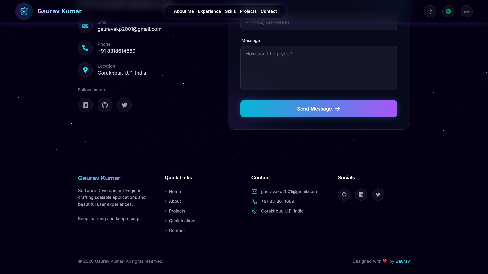

<a name="readme-top"></a>

<div align="center">

# ✨ Space Portfolio

**A modern, animated developer portfolio built with Next.js 14, TypeScript, Tailwind CSS and Three.js**

[](https://gauravk04-portfolio.netlify.app/)

[](https://nextjs.org/)
[](https://www.typescriptlang.org/)
[](https://tailwindcss.com/)
[](https://threejs.org/)
[](https://www.framer.com/motion/)

</div>

<br />



<br />

## 📖 Table of Contents

- [About](#-about)
- [Features](#-features)
- [Tech Stack](#️-tech-stack)
- [Screenshots](#-screenshots)
- [Project Structure](#-project-structure)
- [Getting Started](#-getting-started)
- [Environment Variables](#-environment-variables)
- [Available Scripts](#-available-scripts)
- [Deployment](#-deployment)
- [Connect](#-connect)

<br />

## 🚀 About

A full-stack, single-page portfolio site featuring a Three.js black-hole hero animation, an interactive terminal widget, scroll-driven Framer Motion transitions, and content-driven sections for experience, skills, projects and contact — all built on the Next.js App Router.

## ✨ Features

- 🌌 **Interactive 3D background** — a Three.js/React Three Fiber starfield and black-hole scene rendered behind the entire page
- 💻 **Custom terminal widget** — a mock shell in the hero section that responds to typed commands
- 🎞️ **Scroll-based animations** — section reveals and micro-interactions powered by Framer Motion
- 🧩 **Content-driven sections** — About, Experience & Education, Skills, Projects and Contact, all sourced from a single typed constants file
- 📱 **Fully responsive** — mobile-first layout with a dedicated bottom navigation on small screens
- ⚡ **Optimized images & fonts** — `next/image` and `next/font` throughout
- 🎨 **Themeable design tokens** — centralized Tailwind config and CSS variables

## 🛠️ Tech Stack

| Category | Technology |
| --- | --- |
| Framework | [Next.js 14](https://nextjs.org/) (App Router) |
| Language | [TypeScript](https://www.typescriptlang.org/) |
| Styling | [Tailwind CSS](https://tailwindcss.com/) |
| Animation | [Framer Motion](https://www.framer.com/motion/) |
| 3D / WebGL | [Three.js](https://threejs.org/) via [React Three Fiber](https://docs.pmnd.rs/react-three-fiber) & [Drei](https://github.com/pmndrs/drei) |
| Icons | [React Icons](https://react-icons.github.io/react-icons/), [Heroicons](https://heroicons.com/), [FontAwesome](https://fontawesome.com/) |
| Deployment | [Netlify](https://www.netlify.com/) |

<br />

## 📸 Screenshots

<table>
  <tr>
    <td align="center" width="50%">
      <br />
      <sub><b>About Me</b></sub>
    </td>
    <td align="center" width="50%">
      <br />
      <sub><b>Experience & Education</b></sub>
    </td>
  </tr>
  <tr>
    <td align="center" width="50%">
      <br />
      <sub><b>Skills</b></sub>
    </td>
    <td align="center" width="50%">
      <br />
      <sub><b>Projects</b></sub>
    </td>
  </tr>
</table>

<p align="center">
  <br />
  <sub><b>Contact & Footer</b></sub>
</p>

<br />

## 📁 Project Structure

```bash
Portfolio/
├─ public/                    # Static assets (images, videos, icons)
├─ src/
│  ├─ app/                    # Next.js App Router: layout, page, global styles
│  ├─ components/
│  │  ├─ layout/              # Navbar, Footer
│  │  ├─ effects/             # Three.js star / black-hole background
│  │  ├─ sections/            # Top-level page sections (hero, about, experience, skills, projects, contact)
│  │  └─ ui/                  # Reusable pieces used inside sections (terminal, project-card, skill-text, ...)
│  ├─ config/                 # Site metadata (SEO, Open Graph)
│  ├─ constants/              # Typed content data (nav links, socials, projects, skills)
│  └─ lib/                    # Utilities and shared Framer Motion variants
├─ next.config.js
├─ tailwind.config.ts
├─ tsconfig.json
└─ package.json
```

<br />

## 🧰 Getting Started

### Prerequisites

- [Node.js](https://nodejs.org/) 18+
- [Git](https://git-scm.com/)

### Installation

```bash
# Clone the repository
git clone https://github.com/Gauravk04/Portfolio.git
cd Portfolio

# Install dependencies
npm install

# Run the development server
npm run dev
```

Open [http://localhost:3000](http://localhost:3000) in your browser to see the result.

<br />

## 🔐 Environment Variables

The app runs with zero required environment variables. An optional `.env.local` is only needed if you wire up the 21st.dev MCP integration for AI-assisted component generation during development:

```bash
# .env.local (optional, dev tooling only)
API_KEY_21ST=your_21st_dev_api_key
```

<br />

## 📜 Available Scripts

| Command | Description |
| --- | --- |
| `npm run dev` | Start the app in development mode |
| `npm run build` | Create an optimized production build |
| `npm run start` | Run the production build locally |
| `npm run lint` | Lint the codebase with ESLint |

<br />

## ☁️ Deployment

The live site is deployed on [Netlify](https://gauravk04-portfolio.netlify.app/). It also deploys out of the box on [Vercel](https://vercel.com/new) — connect the repository and it will detect the Next.js build automatically. See the [Next.js deployment docs](https://nextjs.org/docs/deployment) for other hosting options.

<br />

## 🔗 Connect

**Gaurav Kumar**

[](https://www.linkedin.com/in/gaurav-k04/)
[](https://github.com/Gauravk04)
[](https://x.com/Gaurav_K__)

<p align="right">(<a href="#readme-top">back to top</a>)</p>
